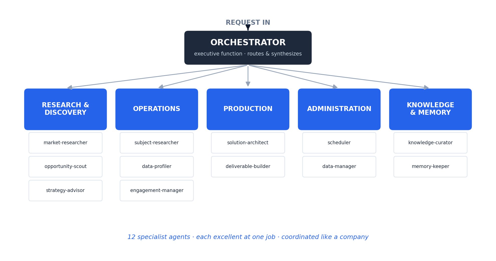

# Agent Operations Framework

> A multi-agent system organized like a real company. An orchestrator routes work across five specialist departments, every output is sourced, and when the system hits a capability it lacks, it finds or builds that capability and keeps it.

**Short on time? Open [`SHOWCASE.pdf`](SHOWCASE.pdf) for the 2-minute version. No code required.**

**Want the deep dive? Read the full [User Manual (PDF)](agent_operations_framework_manual.pdf)** — architecture, the Capability Gap Protocol, design rationale, and a worked example.

---

## What makes it different

Most agent systems are a flat set of tools that fail when they hit something new. This one has three properties most don't:

1. **Organized like a company.** Five departments, twelve specialist agents, an orchestrator as executive function. Structure modeled on how high-performing organizations actually divide work.
2. **Self-extending.** When no agent can handle a task, the **Capability Gap Protocol** scouts open-source agents/tools, adapts or builds one, and registers it permanently. The system grows its own capabilities.
3. **Self-improving.** A Knowledge & Memory department captures lessons and refines agents after each run, so the system gets better with use instead of decaying.

## How it works

| Step | What happens |
|---|---|
| Request in | The orchestrator interprets intent |
| Route | Work is delegated to the right department(s) |
| Execute | Specialist agents do their one job well |
| Gap? | If a capability is missing, the Capability Gap Protocol acquires it |
| Deliver | Output assembled with every field tagged Confirmed / Estimated / Missing |
| Learn | Knowledge & Memory captures what worked for next time |

## The five departments

- **Research & Discovery** — research, opportunity sizing, capability scouting
- **Operations** — subject research, data profiling, engagement tracking
- **Production** — solution design, deliverable building
- **Administration** — scheduling, data hygiene, catalog ownership
- **Knowledge & Memory** — lessons captured, history recalled

Full registry in [`code/CATALOG.md`](code/CATALOG.md). Each agent is a Markdown file under `code/teams/`.

## Key documents

- **[Capability Gap Protocol](docs/capability-gap-protocol.md)** — how the system extends itself
- **[Example run](docs/example-run.md)** — the protocol firing on a real-style request
- **[CATALOG](code/CATALOG.md)** — the full org chart and agent registry

## Tech

`Claude` · multi-agent orchestration · Markdown-defined agents · structured sourcing discipline

---

*Part of the [AI Operations Portfolio](../README.md). A clean-room, domain-neutral rebuild of a system proven in production. No proprietary content.*
