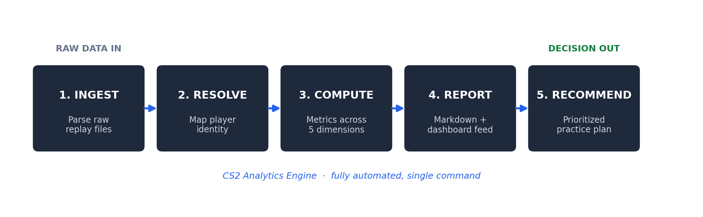

# CS2 Analytics Engine

> An end-to-end analytics pipeline that ingests raw game-replay files and automatically produces a sourced, actionable performance report with specific, data-driven recommendations.

**New to GitHub or short on time? Open [`SHOWCASE.pdf`](SHOWCASE.pdf) for the 2-minute visual breakdown. No code required.**

**Want the deep dive? Read the full [User Manual (PDF)](cs2_analytics_engine_manual.pdf)** — the five-stage pipeline, analytical depth, and design tradeoffs.



---

## The Problem

Improving at a complex competitive game means knowing *specifically* what you did wrong, not getting generic advice. The raw data exists inside every match replay file, but it is locked in a dense binary format. Turning it into "here is your actual weakness and here is what to practice" requires parsing thousands of in-game events and positional snapshots, computing the right metrics, and translating them into plain-language recommendations.

The same problem shows up everywhere in operations: **raw, messy data that contains the answer, with no automated path from data to decision.**

## The Approach

I built a multi-stage Python pipeline that runs with a single command:

1. **Ingest** — Parse raw replay files using `demoparser2`, extracting kill/death events, weapon data, and positional tick data for every player across every round.
2. **Resolve identity** — Map a display name to a canonical player ID across multiple matches so stats aggregate correctly.
3. **Compute metrics in tiers:**
   - *Mechanical:* K/D, headshot %, per-weapon and per-side accuracy
   - *Positional:* nearest-teammate distance, close-support vs. lone-wolf rate (from raw tick data)
   - *Behavioral:* survival rate, first-death rate, trade participation, pre-aimed-death rate
   - *Situational:* clutch performance by scenario, enemy-context heuristics
4. **Generate the report** — Produce a clean markdown report plus a JSON sidecar that feeds a touch-friendly web dashboard.
5. **Recommend** — Translate the computed weaknesses into specific, prioritized practice recommendations.

## The Results

- **2,583 lines of Python** across a modular analyzer package
- Processes **13 matches / 292 rounds** in a single run, fully automated
- Produces a report with **sourced metrics across five analytical dimensions** and **specific, prioritized recommendations** tied to the data (not generic advice)
- A FastAPI daemon serves the results to a touch-friendly web dashboard

See [`sample-output/weekly-report-sample.md`](sample-output/weekly-report-sample.md) for a real generated report.

## What This Demonstrates

| Skill | How it shows up here |
|---|---|
| **Data pipeline engineering** | Raw binary files → parsed events → computed metrics → report, end to end |
| **Turning data into decisions** | The output is not a dashboard of numbers; it is prioritized, plain-language recommendations |
| **Sourced, trustworthy output** | Every metric traces back to the raw data with no manual entry |
| **Scope discipline** | Built the high-leverage analytics slice; explicitly deferred lower-value work |
| **Full-stack delivery** | Python analysis + FastAPI service + web dashboard |

This is the same pattern I apply to operations work: **take raw, messy data and build the system that turns it into a decision someone can act on.**

## Tech at a Glance

`Python` · `demoparser2` · `FastAPI` · `pandas`-style data transforms · `JavaScript` / HTML / CSS dashboard

## How to Run (optional, for technical reviewers)

```bash
# From the code/ directory
python -m analyzer.run_report "PlayerName"
```
Requires `demoparser2` and replay files. Most reviewers should just read the SHOWCASE and the sample output.

---

*Part of the [AI Operations Portfolio](../README.md) by John White.*
