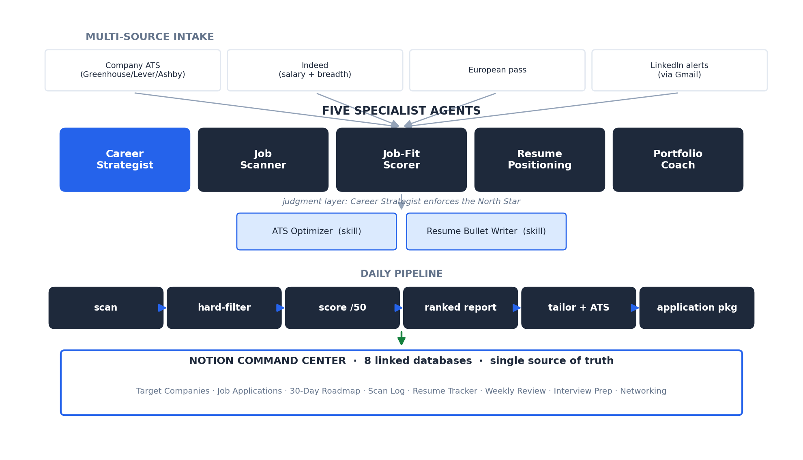

# AI Career Operations System

> A complete, multi-agent operating system for running a career transition like an operations function. Not a job scanner — a five-agent suite, two custom skills, a Notion command center with eight linked databases, a multi-source intake pipeline (ATS boards, Indeed, and LinkedIn alerts via Gmail), a North Star scoring rubric that enforces hard-won criteria, a resume-tailoring engine with ATS optimization, and an application-package generator, all coordinated into one daily workflow. It is running the search that produced this portfolio.

**Short on time? Open [`SHOWCASE.pdf`](SHOWCASE.pdf) for the 2-minute version.**

**Want the deep dive? Read the full [User Manual (PDF)](ai_career_operations_system_manual.pdf)** — the full system, daily workflow, and a worked example.



---

## The Problem

A career transition produces the same failure mode as any unmanaged operation: noise, inconsistency, and no system of record. Hundreds of postings, most wrong on role, industry, comp, or location. Resumes drift out of sync with the roles they target. Applications get tracked in your head until they don't. And the real risk underneath all of it: taking another misaligned job because evaluating each opportunity rigorously does not scale by hand.

The last bad fit is exactly what this system exists to prevent.

## The Approach: run the job search as an operations function

Rather than treat job-hunting as a series of one-off tasks, this system treats it as a managed pipeline with specialist agents, a single source of truth, and a daily cadence — the same way you would run a real operation. The human supplies judgment; the system supplies synthesis, scoring, tracking, and drafting.

---

## The Components

### Five specialist agents (`code/agents/`)

| Agent | What it does | When it runs |
|---|---|---|
| **Career Strategist** | Holds the North Star. Evaluates opportunities against the decision filter and challenges any drift toward misaligned (sales-heavy, wrong-industry, quota-carrying) roles. The judgment layer that keeps the whole system honest. | On demand, when weighing a decision |
| **Job Scanner** | Runs the multi-source daily scan: company ATS boards, Indeed, a European pass, and LinkedIn job-alert emails pulled from Gmail. Filters, scores, writes a ranked report, and syncs to Notion. | Daily, or before an application session |
| **Job-Fit Scorer** | The scoring engine. Rates every role 1–10 across five dimensions (Role Fit, Background Match, Industry Fit, Compensation, Location) for a total out of 50, with non-negotiable hard stops. | Invoked by the Scanner on every role |
| **Resume Positioning** | Tailors the resume per posting from a master accomplishment library, across three positioning variants (AI Operations / Optimization & Analytics / Technical Operations). | Per application |
| **Portfolio Coach** | Advises on the portfolio work itself (this repository) — scope, framing, what makes a project stand out. | During portfolio building |

### Two custom skills (`code/skills/`)

| Skill | What it does |
|---|---|
| **ATS Optimizer** | Scores a tailored resume against a specific posting for keyword and format match, targets 80%+, and flags genuine gaps without keyword-stuffing or fabricating experience. |
| **Resume Bullet Writer** | Enforces the bullet standard: strong action verb + specific method + quantified outcome. Pulls from a fixed library of confirmed accomplishment figures so numbers stay accurate. |

### One command center (Notion, eight linked databases)

Everything syncs to a Notion HQ so the system has a single source of truth that never drifts:

| Database | Purpose |
|---|---|
| **Target Companies** | The watchlist, tiered, with North Star fit rating and remote status |
| **Job Applications** | The pipeline: every role with its /50 fit score, salary, status |
| **30-Day Roadmap** | Milestone tracker for the transition plan |
| **Scan Log** | History of every scan run — trends over time |
| **Resume Tracker** | Every resume version, ATS score, file location, format |
| **Weekly Review** | Application metrics + recalibration discipline |
| **Interview Prep** | Per-company prep, linked to applications |
| **Networking** | Outreach tracking, linked to companies |

Relationships are wired: Applications link to Companies, Networking links to Companies, so the whole system stays connected.

---

## How to Use It

### Daily scan + application session

```
1. Run the Job Scanner agent.
   It loads the watchlist, the scorer rubric, and the existing tracker
   (so nothing surfaces twice), then runs all sources.

2. Review the ranked report.
   Only roles scoring 28+ appear, sorted Pursue Strong / Pursue / Monitor,
   each with per-dimension scores, why it fits, honest gaps, and a
   recommended next action.

3. For a role worth pursuing:
   - Run Resume Positioning to tailor the right resume variant.
   - Run the ATS Optimizer skill against the posting; iterate to 80%+.
   - Generate the application package (resume + screening answers + cover letter).

4. Apply, then log it in Notion (status -> Applied).

5. The system syncs the scan to Notion automatically every run.
```

### The daily workflow, visualized

```
scan (multi-source)  ->  hard-filter  ->  score (/50)  ->  ranked report  ->  sync to Notion
                                                                 |
                                 tailor resume  ->  ATS-optimize  ->  application package
                                                                 |
                                          apply  ->  log in Notion  ->  networking outreach
```

---

## A Worked Example

**A LinkedIn alert email arrives** for "AI Operations Lead at [Company]." The email has a company and a title but no job description.

1. **Job Scanner** extracts the (company, title) pair from the Gmail message.
2. Because the LinkedIn link is behind a login wall, the scanner **finds the real public posting** on the company's Greenhouse board instead.
3. It fetches the full description and runs the **hard filter** — not quota-carrying, not below the comp floor, right industry. It passes.
4. **Job-Fit Scorer** rates it: Role Fit 9, Background Match 9, Industry Fit 8, Compensation 10, Location 9 → **45/50, Pursue Strong.**
5. The role lands at the top of the ranked report with a note: "Claude development is a preferred skill — you have it. Apply this week."
6. The scanner **syncs it to the Notion Job Applications database** (status: Drafting) and logs the scan.
7. The human runs **Resume Positioning** + **ATS Optimizer**, generates the package, applies, and flips the Notion status to Applied.

A wall (LinkedIn blocking bots) routed around with a different source — surfaced, scored, tracked, and drafted, with the human only making the apply/no-apply call.

---

## The Differentiators

**1. It is a full operating system, not a tool.** Five agents, two skills, eight databases, and a daily cadence — coordinated. Most people build a scraper. This is the difference between automating a task and operating a function.

**2. It encodes judgment, not just keywords.** The scoring rubric carries hard-won personal criteria, including an explicit hard-stop for the kind of role that was a bad fit last time. The system's job is not to find the most jobs; it is to protect against the wrong ones, every run.

**3. It closes every loop.** Scan results, application status, resume versions, networking, and weekly metrics all live in one linked system of record. Nothing is tracked in someone's head.

**4. Proven by its own output.** This system ran the search that generated this portfolio and the applications behind it. It is not a demo; it is in production on the most important project its author has.

---

## What This Demonstrates

| Skill | How it shows up here |
|---|---|
| **Multi-agent system design** | Five coordinated specialist agents with a judgment layer |
| **Operations thinking** | A job search run as a managed pipeline with a system of record |
| **Encoding judgment into a system** | The North Star rubric enforces personal criteria automatically |
| **Multi-source integration** | ATS boards, Indeed, Gmail/LinkedIn, and Notion (read + write) |
| **Working around constraints** | LinkedIn blocks bots, so the system finds the public posting instead |
| **End-to-end ownership** | From scan all the way to a ready-to-submit application package |

## What's in this folder

- [`code/agents/`](code/agents/) — the five agents: Career Strategist, Job Scanner, Job-Fit Scorer, Resume Positioning, Portfolio Coach
- [`code/skills/`](code/skills/) — the two custom skills: ATS Optimizer, Resume Bullet Writer
- [`sample-output/daily-scan-sample.md`](sample-output/daily-scan-sample.md) — a real (redacted) ranked daily scan report

## Tech

`Claude` · multi-agent orchestration · Gmail integration · Notion integration (8 linked databases) · ATS + web search · resume tooling

---

*Part of the [AI Operations Portfolio](../README.md) by John White. Personal scoring criteria are kept; paths, IDs, tracked roles, and any customer/deal specifics are genericized. No private data.*
