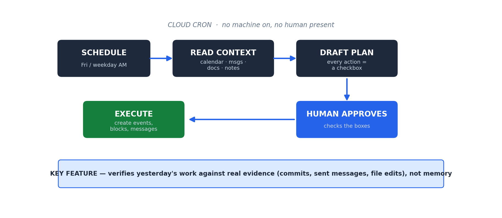

# Autonomous Planning System

> Two scheduled agents that run in the cloud on a cron. One builds a weekly plan every Friday; one builds a daily review every weekday morning. Each reads real context across five tools, drafts a proposal where every action is a checkbox, and waits for one-click human approval before anything is created. The standout feature: it verifies what you actually did yesterday against the evidence, rather than trusting your memory.

**Short on time? Open [`SHOWCASE.pdf`](SHOWCASE.pdf) for the 2-minute version.**

**Want the deep dive? Read the full [User Manual (PDF)](autonomous_planning_system_manual.pdf)** — architecture, the evidence-verification feature, and a worked example.



---

## The Problem

Planning tools make you do the planning. They hand you an empty calendar and a task list and leave the synthesis — what matters this week, what slipped yesterday, what to move — entirely to you. And almost none of them can answer the one question that actually matters at the start of a day: *did the things I committed to yesterday actually happen?* Relying on memory for that is unreliable, and quietly dropped commitments are how trust erodes.

## The Approach

Two agents on a schedule, with a human-approval gate so the system proposes but never acts on its own.

- **Friday Weekly Planner** reads context (a priorities document, calendar, messages, shared docs, meeting notes), then drafts next week's plan: the week's theme, the anchor deliverables, the biggest risk, recommended task blocks, and meetings that need attention. Every suggested action is a checkbox.
- **Weekday Daily Reviewer** runs every morning: it recaps yesterday (with evidence), then adjusts today.

Both write their proposal as a file and notify the human. The human reviews, checks the boxes they want, and says "approve." Only then does an approval skill create the calendar events, task blocks, and messages. **The agent does the synthesis; the human keeps the judgment.**

---

## The Components

### Three building blocks (`code/`)

| File | Role |
|---|---|
| [`weekly-planner.md`](code/weekly-planner.md) | The Friday agent: reconciles prep folders, builds next week's plan in a fixed structure, and auto-generates a prep note for each task block. |
| [`daily-reviewer.md`](code/daily-reviewer.md) | The weekday agent: includes the evidence-based verification of yesterday's work, then proposes today's adjustments. |
| [`approval-skill.md`](code/approval-skill.md) | The human-in-the-loop execution step: scans the proposal for checked items, creates them via the connected tools, and logs an audit trail. |

### Context as the control surface

A single priorities/context document steers every run. It holds the current constraints, the active projects, and a numbered set of planning principles the agents cite by number. When a run drifts from reality, the fix is to add the missing context to that one document — not to edit the agents. The maintenance loop is literally: *"what context would have prevented this?"*

---

## The Differentiator: it verifies reality, it doesn't trust memory

The highest-value feature is the **yesterday recap with evidence**. For each task block from the day before, the agent does not ask "did you do this?" It checks the evidence across the connected tools and assigns a status:

| Status | Evidence required |
|---|---|
| **Verified Complete** | A concrete artifact: a commit, a sent message, or a file modified at a specific time by the user |
| **Likely Complete** | Partial or indirect evidence |
| **Unverified** | No trace found — flagged for the human to either finish today or formally drop |

It also checks: commitments made yesterday ("I'll send X by EOD" — did it ship?), inbound asks (did the human reply?), and meetings attended. Knowing "the document was edited at 4:47 PM yesterday and the system confirms it was you" is a far stronger signal than relying on memory. This catches dropped commitments before they become problems, and it is the feature that makes the whole system trustworthy rather than just another planner.

---

## How to Use It

### One-time setup

```
1. Connect the tool integrations the agents read from
   (calendar, messaging, docs, notes, and a repo for the plan files).
2. Write the context/priorities document — current constraints,
   active projects, and your numbered planning principles.
3. Schedule the two agents on cron:
   - Weekly Planner: Friday morning
   - Daily Reviewer: weekday mornings
4. (Optional) Add a session-start hook to auto-pull the latest
   plan files the cloud agents committed.
```

### The daily rhythm (5–10 minutes total)

```
Morning: a notification lands that the daily review is ready.
  -> Read the Yesterday Recap: are you caught up? Anything Unverified
     to finish or drop?
  -> Read the Approval section: what will run if you approve.
  -> Check the boxes you want, say "approve daily changes."
  -> The approval skill creates the events / blocks / messages and
     logs the run. ~30 seconds.

Friday: same flow against the weekly plan ("approve weekly plan").
```

The agent does the synthesis across all your tools; you spend a few minutes on judgment and approval.

---

## A Worked Example

A weekday morning. The **Daily Reviewer** has already run in the cloud.

**It reads yesterday's three task blocks and verifies each against evidence:**
- "Draft the project proposal" → **Verified Complete** (file modified 4:47 PM, last editor confirmed)
- "Send follow-up to stakeholder" → **Verified Complete** (message sent 2:11 PM)
- "Review the analysis model" → **Unverified** (no artifact found)

**It checks commitments:** yesterday you wrote "will send the summary by EOD" — confirmed sent 5:52 PM. And an inbound ask for a timeline — not yet answered, queued for this morning.

**It proposes today, revised:** a 9:00 block to answer the timeline ask (tied to your "respond within one business day" principle), the analysis-model block moved earlier to protect it before it slips again, deep-work block unchanged.

**The Approval section** lists three checkboxes. You check the two you want, say "approve daily changes," and the approval skill creates them and logs it. The unverified task you decide to finish today rather than drop.

Nothing reached your real calendar without your check. The system surfaced a slipping commitment you might have forgotten — that is the whole point.

---

## What This Demonstrates

| Skill | How it shows up here |
|---|---|
| **Scheduled, autonomous operation** | Cloud cron agents that run with no machine on and no human present |
| **Multi-source reconciliation** | Synthesizes calendar, messages, docs, and notes into one plan |
| **Evidence-based verification** | Confirms completed work against real artifacts, not self-report |
| **Human-in-the-loop design** | Proposes everything, executes only what a human approves, with a full audit trail |
| **Context as the control surface** | A single priorities doc steers every run; drift is fixed by editing context, not code |

## What's in this folder

- [`code/weekly-planner.md`](code/weekly-planner.md) — the weekly planning agent's responsibilities and output structure
- [`code/daily-reviewer.md`](code/daily-reviewer.md) — the daily review agent, including the verification logic
- [`code/approval-skill.md`](code/approval-skill.md) — the human-approval execution step
- [`sample-output/daily-review-sample.md`](sample-output/daily-review-sample.md) — a redacted daily review showing the verification feature

## Tech

`Claude` · cloud cron scheduling · calendar / messaging / docs / notes integration · human-in-the-loop approval

---

*Part of the [AI Operations Portfolio](../README.md) by John White. A clean-room write-up of a system proven in production — no proprietary content.*
