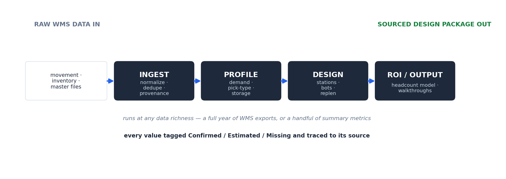

# ops-profiler

> A warehouse-design analytics engine. It ingests a customer's raw WMS data — a year of movement, inventory, and physical master files — and produces a complete, sourced design package: demand percentiles, pick-type profile, storage requirements, first-principles **system sizing (station and bot counts)**, and a **headcount ROI model** that justifies the purchase. Every value is tagged Confirmed / Estimated / Missing and traced to its origin. It turned roughly a week of senior analyst work into a one-command run.

**Short on time? Open [`SHOWCASE.pdf`](SHOWCASE.pdf) for the 2-minute version.**

**Want the deep dive? Read the full [User Manual (PDF)](ops_profiler_manual.pdf)** — the four-stage pipeline, a worked sizing example with the math shown, and design rationale.



---

## The Problem

When a robotics company evaluates a warehouse for automation, a solutions engineer has to answer hard quantitative questions from whatever data the customer can provide: How many orders a day, at peak? What does the picking work actually look like? How many storage positions, pick stations, and bots will the system need? And the question that closes the deal — how much labor cost does this displace?

Done by hand, this was roughly a week of senior-analyst work per engagement in Excel: clean the exports, build the percentiles, model the system size, triangulate the headcount, assemble the deck. It was slow, it varied by who did it, and three weeks later nobody could say which numbers were confirmed by the customer versus assumed by the team — which is fatal in a design review.

## The Approach

A multi-stage analytics pipeline that goes all the way from raw files to a sourced design package.

```
raw WMS data        ingest            profile             design               ROI / output
(movement,      →  normalize +   →   demand · pick-   →   first-principles  →  headcount model
inventory,          dedupe +         type · storage       sizing: stations,    + customer
master files)       provenance       percentiles          bots, replen         walkthroughs
```

It runs at **any data richness level** — a full year of WMS exports at one end, a handful of summary metrics at the other — and produces design-usable output either way. Every value carries a source pointer, so the entire package is auditable.

## What It Actually Produces

For a single engagement, from one command:

- **Demand analysis** — order/line/unit percentiles (avg, P95, P99, peak day), seasonality by month and day-of-week
- **Pick-type profile** — piece vs. case vs. pallet split, top SKUs per type (this decides the automation approach)
- **Storage profile** — pallets-per-SKU, pallet-height estimates, total positions needed, pareto
- **System sizing** — first-principles pick-station count and bot count, with the math shown and assumptions stated
- **Headcount ROI** — current vs. post-automation FTEs, annual labor savings, plus an Excel ROI workbook for the deal team
- **Customer-facing deliverables** — alignment walkthrough, proposal walkthrough
- **Engineering deliverable** — a structural/facilities brief
- **Audit trail** — checkpoint files at every stage (ingest → velocity → physical → scenarios), a gap report, and full provenance

See [`sample-output/`](sample-output/) for a real, anonymized analysis overview, a system-sizing estimate (with the math), and the headcount ROI model.

## The Differentiators

**1. It goes from raw data to a financial decision — not just a profile.** Most data tools stop at "here are your numbers." This one keeps going through system sizing and into a headcount ROI model. It produced the savings figure that justified the system purchase, with every input sourced.

**2. First-principles sizing, with the math exposed.** Station and bot counts are derived from line volume, cycle times, utilization, and stated assumptions — never from a template. A reviewer can see exactly how a "6 stations" recommendation was reached and challenge any input. (See the sample station-count estimate.)

**3. Confidence from provenance, applied as one rule.** A value the customer stated is Confirmed; a derived or AI-extracted value is Estimated; a required value never found is Missing. One rule set, applied identically every run, so the whole package is trustworthy in a design review.

**4. Deterministic core, AI only at the edges.** Parsing, percentile math, and sizing are deterministic. The AI is used only for genuinely fuzzy jobs — mapping inconsistent column headers, pulling values out of prose — and its output is always checked against the canonical schema before it is accepted. The AI proposes; the rules dispose. It never touches the math.

## The Payoff

| By hand | ops-profiler |
|---|---|
| ~a week of senior-analyst work per engagement | one-command run |
| inconsistent methodology between engineers | identical every run |
| provenance lost when the workbook closed | every value permanently traceable |
| gaps discovered late, often in the review | gaps surfaced up front |
| system sizing + ROI assembled manually in Excel | generated automatically, sourced |

**Used on live customer engagements, including a deal where the pricing landed exactly where the customer expected.**

## What This Demonstrates

| Skill | How it shows up here |
|---|---|
| **Operations-research analytics** | Percentile design points, first-principles system sizing, throughput modeling |
| **Business-impact modeling** | A full headcount ROI model that justified a capital purchase |
| **Trustworthy AI system design** | Deterministic core; AI confined to checked edges; never touches the math |
| **Data engineering** | Ingest/normalize/dedupe across a year of multi-file WMS exports |
| **Provenance architecture** | Every value traceable; confidence assigned by one rule set |
| **Operational impact** | A week of analyst work compressed to one command, output defensible enough to price on |

## What's in this folder

- [`code/src/`](code/src/) — the core modules: typed models (no orphan values), provenance tracking, the confidence rule set, the checked AI extractor, and the report renderer
- [`sample-output/full-analysis-overview.md`](sample-output/full-analysis-overview.md) — everything generated for one engagement
- [`sample-output/design-station-count-estimate.md`](sample-output/design-station-count-estimate.md) — first-principles sizing with the math shown
- [`sample-output/headcount-roi-summary.md`](sample-output/headcount-roi-summary.md) — the financial case

## Tech

`Python` · `DuckDB` · `pandas` / `NumPy` · deterministic core · `Claude` (checked AI edges) · provenance tracking · ~228-field design schema

---

*Part of the [AI Operations Portfolio](../README.md) by John White. A clean-room representation of a tool proven in production. The code modules here demonstrate the core architecture; sample outputs are real and fully anonymized. No proprietary content or customer-identifying data.*
